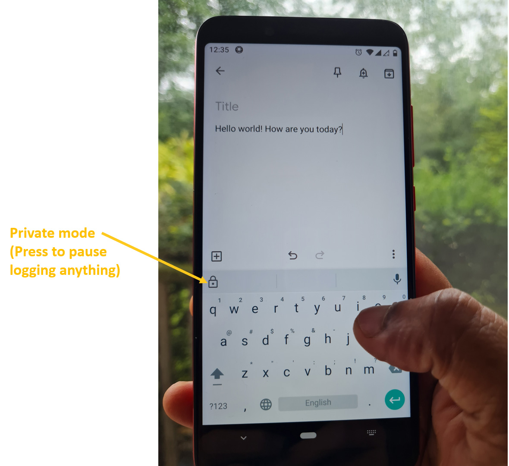
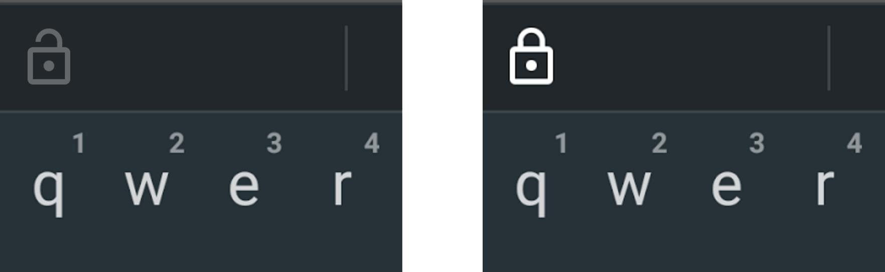
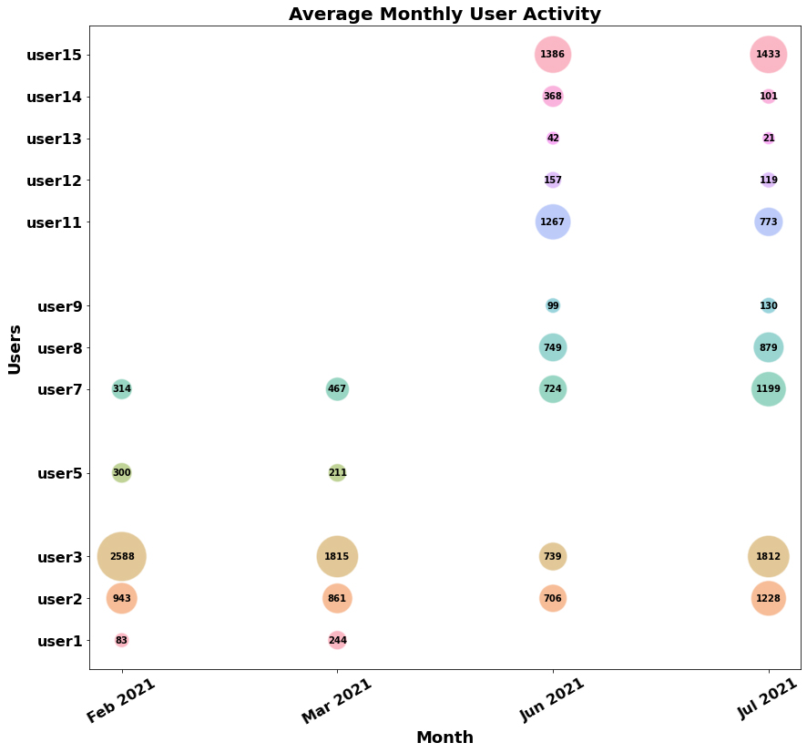
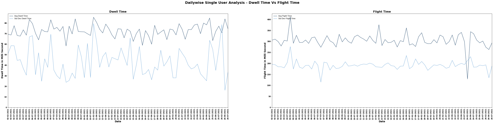
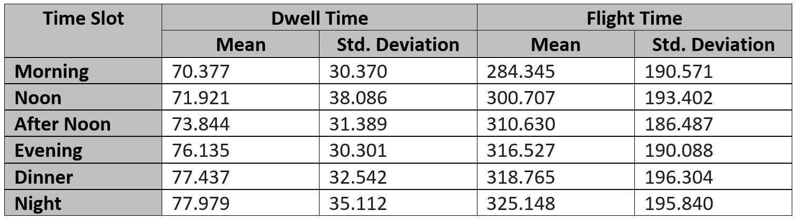
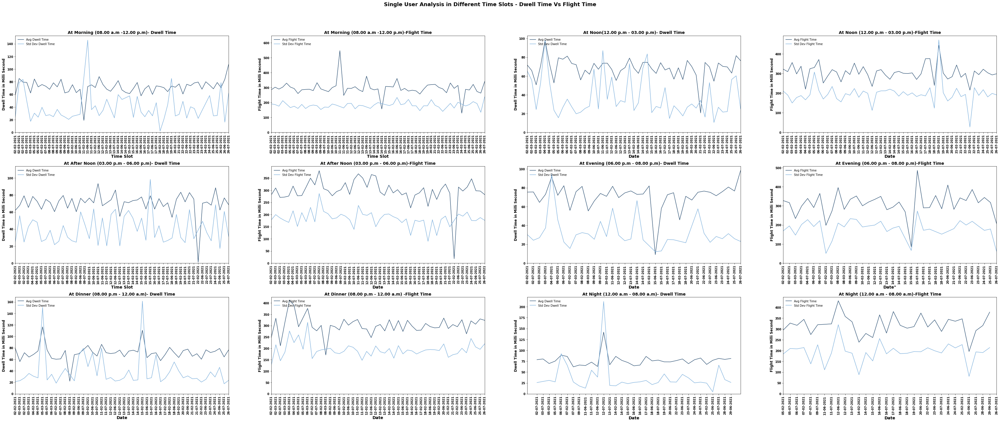
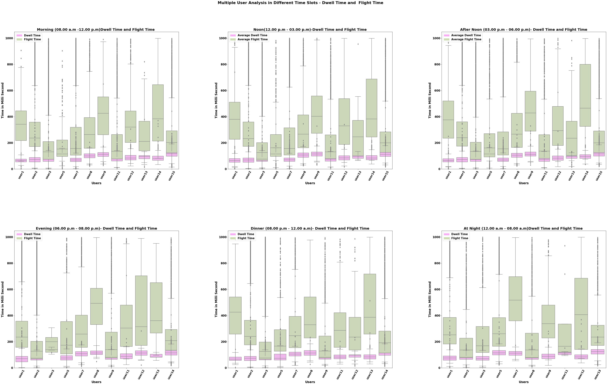
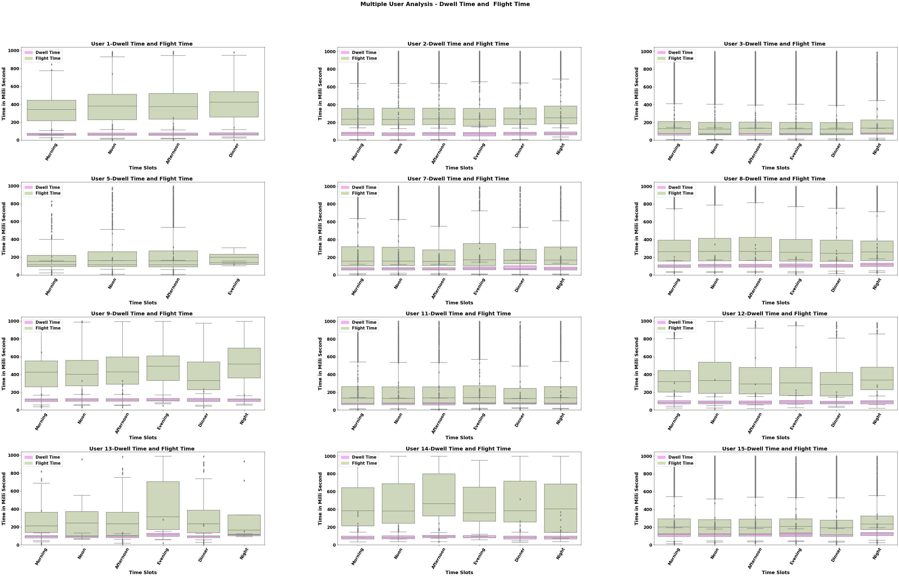
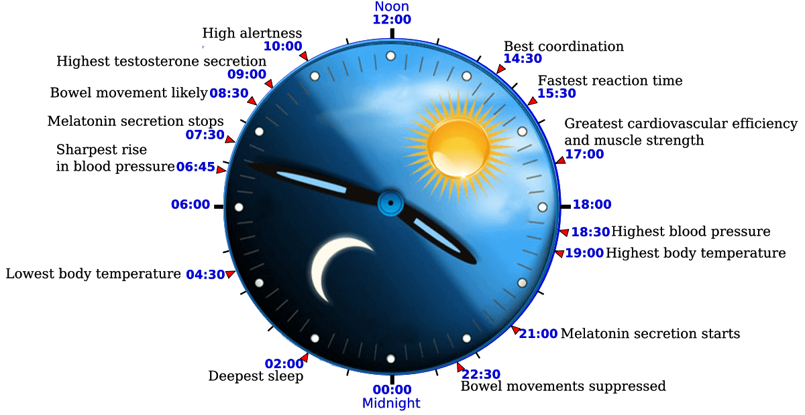

# Correlation Between Keystroke Dynamics On Mobile Devices With Time
In this research we set out to find the answer to the question of how features associated with  keystroke dynamics when using a mobile device, such as typing speed varies in accordance with the time of day for a typical user. We do this by collecting keystroke dynamics metadata using an Android keyboard application called Language Logger, from a set of 15 users over a period 80 days with metadata for 344,995 actual keystrokes.  This includes date and time of typing on the smartphone, along with timing information covering dwell time while a key is pressed, and flight time as the time taken to move to the next key, in a stream of continuous keyboard data entry.
Our results find that there are large variance across users and some are affected by time of day while others are not.However, there are other factors which impact alertness and hence typing speed which we cannot account for such as mood or energy level, and this would be future work.
# I. INTRODUCTION
As we know, mobile phones are an indispensable part of everyday life. According to a study conducted by Statista in 2020, the number of mobile users worldwide stood at 6.95 billion, with forecasts suggesting, this is likely to rise to 7.1 billion by 2021[22].The popularity of mobile phones and their easy accessibility to the internet results in people increasingly communicating via typed communication rather than oral communication. 

Interestingly, with such an increase in the use of typing information onto smartphone devices, we believe there could  exist a  relationship between typing speed on the device, and time of the day.  This could be based on the fact that people are more or less alert and attentive to their typing depending on whether they are more or less tired and this fatigue, which varies throughout the day, may be demonstrated in different typing speeds at different times of day. 

In this work we record keystroke dynamics on mobile devices during daily usage and analyse how it correlates with different times of a day. Keystroke dynamics, keystroke bio-metrics, typing dynamics and lately typing bio-metrics, refer to the detailed timing information which describes exactly when each key was pressed and when it was released as a person is typing on a mobile keyboard[19].

The rest of this paper is organised as follows. In the next section we provide a review of related work, and then the system description of the keystroke logging application we used along with the  logging information. That is followed by a description of raw data collection, the  data analysis steps, and the conclusions drawn from that analysis  and finally some indications of future work. 

# II. RELATED WORK
The original application for keystroke dynamics with accurate timing information was as a form of user authentication and work in this area goes back over 4 decades, from 1980 onwards and with regular re-visits to the topic e.g. [6] [11] [14]. One of the most important advantages of keystroke dynamics is low implementation and deployment cost [27]. Keystroke dynamics based authentication uses keystroke patterns provided by the user who wants to be authenticated. Bio-metric data for keystroke dynamics are extracted by finding numerous timing characteristics related to keystrokes [6] [3] [16] [12]. These timing characteristics are then transformed to some feature descriptors in order to represent human behaviour with the keyboard. Principally, the following two timing features are used in keystroke dynamics: (a) dwell time is the time lag between press and release of a key and (b) flight time is the time lag between press and release of two successive keys [6][3][21].

Figure 1 shows timing information logged when a user types the the word ‘HELLO’ on a smartphone. A Di-graph is the timing information between two consecutive keystrokes [9][24] and can be grouped into two classes, including dwell time (DT) or Hold Time and Flight Time (FT) or Latency. Dwell time corresponds to the hold time, which is the time interval between key press and key release and flight time is the time interval between releasing one key and pressing the next key, or in other words the time taken for the user’s finger to ‘fly’ from one key to the next [4]. In Figure 1 we see that when the user pressed the “H” key it was a time 0.062 seconds into the recording (point P1) and then the user released the “H” key at time 0.146 seconds into the recording at point R1, so the dwell time for that key was 0.084 seconds, or 84ms. The user’s finger, and it could be any finger not necessarily the one used to press the H, then pressed the “E” key at time 0.406 seconds or point P2 in the recording and held it pressed for 58ms. The flight time between the “H” and the “E”, the gap between R1 and P2, was 260ms. This example shows the timing characteristics of the keystroke dynamics on a smartphone.

 
<em><b>Figure 1. Di-graph timing information logged when a user types the word ’HELLO’ on a mobile device</b></em>

Keystroke logging is also used in measuring writing fluency and flow and analysis of the timing information can reveal traces of the underlying cognitive processes behind writing or typing [18]. The premise here is that we establish a baseline for our keystroke timing information gathered over a long period and at any given period during the day we can compare the current dynamics with the baseline to see if we are typing faster, or slower, perhaps indicating that we are in full creative flow or that we are pondering our thoughts as we write. This also exploits pause location as we type and whether pauses occur between words, between sentences or even between paragraphs and what insights into the author’s thinking can be gleaned from such pauses [17]

He Huang et al. [13] uses local and periodic typing dynamics for personalised mood prediction. According to their findings, the fastest typing speed occurs at 6:00 and remains
stable between 8:00 to 20:00, and then it becomes significantly slower during the night. They suspect that this is primarily due to fatigue caused by the circadian rhythm which is a biological process that displays an endogenous oscillation of 24 hours [10] [26]. This cycle runs in the background of the human brain and cycles between sleepiness and alertness at regular intervals. It is commonly known that individual depressive moods vary according to the circadian rhythm, as well as with the day of the week [26]. In our work in this paper it will be interesting to see if we observe similar changes to keystroke timing depending on the time of day at which they keystrokes are typed.

There are other applications for keystroke dynamics including cryptography applications [8], adaptive and personalised keyboards [29] and even as digital biomarkers. For example, the ‘BiAffect’ mobile app can be used for identifying persons with bipolar disorder and unobtrusively predicting depression severity [23] and the ‘Neurokeys’ mobile app can give earlywarning signals for disease activity in patients diagnosed with Multiple Sclerosis (MS) [28]. In some recent work, Lam et al.’s studies among 102 subjects with MS and 24 control subjects found that keystroke dynamics are a promising and valid surrogate marker for determination of clinical disability in MS [15]. For this study the participants used a smartphone rather than computer keyboard showing that keystroke dynamics from mobile devices can be just as useful for such applications as dynamics taken from computer keyboards.

This work is a follow-up of previous work by Smeaton, Krishnamurthy and Suryanarayana [25], which records the keystroke dynamics from a person’s laptop during daily usage and analyses the typing speed of a range of bigrams (adjacently-typed alphabetic characters). That work then tried to correlate bigram typing speed with sleep score using data
collected from 4 participants over more than 6 months data logging. In that research, they found that bigram timing information can vary during the same day and across the day
depending, they believe, on the participant’s stress, fatigue and emotions. Also, they noted that there is no correlation between daily typing speed of any of the commonly used
bigrams and sleep score. This result was observed in all participants. In addition, they concluded that a measure of user fatigue based on a simple sleep score from the previous night’s sleep is insufficient to measure participants’ fatigue levels. They concluded that the timing data retrieved from keystroke dynamics could be used as part of a lifelog, especially to gain insights into the more complex cognitive processes in our daily life and it would be interesting to explore keystroke dynamics on mobile devices and see how the timing information from mobile devices might correlate with stress, cognitive load from multi-tasking, fatigue and distraction. In this paper we set out to search for a correlation with time of day.

As we know smartphones play crucial role in our lives and are essential part of every individual today. Smartphones can be thought as an appropriate tool to gather information regarding a person because they are so ubiquitous. Here in this research, we utilise keystroke dynamics from smartphone keyboards as a way to draw inferences in the areas of
behavioural science and other physiologies. Previous studies conducted were primarily focused on personal computer keyboard strokes but in this work, the study is based on keystrokes in smartphones.

Keystroke dynamics on mobile devices is relatively new as compared to keystroke dynamics on desktops and laptops. The first known study of this type was by Clarke et al in 2002 [20] but since then there has been little research work published. In our work we used the ‘LanguageLogger’ [5] [7] Android keyboard application for smartphones to log keystrokes with their timestamps and transfer this timing metadata to a server. This data is then analysed to uncover any underlying correlations between keystrokes and other parameters such as time of day.

It is important to note that we are not concerned with the actual keys that a user presses on their smartphone, and in fact much of the work in this area including ours, does not record the actual keys pressed, just the timing information. This makes issues of user privacy and data protection, much less challenging to manage.

# III.  SYSTEM DESCRIPTION: LANGUAGELOGGER

As a part of collecting data such as keystroke dynamics on mobile devices for this research, we used the open-source Android keyboard application called ‘LanguageLogger’ [5] [7] developed by ‘ResearchIME’.

The LanguageLogger keyboard is built upon Google’s Android Open-Source Project (AOSP) keyboard. This allows participants in our study from whom we gather data, to stick as close as possible to the default keyboard that most Android users already know. Also, it does not change or limit any features of the AOSP keyboard, but adds a small button to enable the user to switch to private mode if s/he prefers, at any time [7]

For addressing privacy concerns, the app never records data for the following fields: password, phone number, person name, postal address or email. In addition, participants can directly control the logging by enabling the private mode button. No data at all is recorded while in private mode. Also, the data that is typed by the user is filtered on the device to avoid logging readable text [7].

Figure 2 shows the AOSP keyboard in use where the user has typed “Hello world! How are you today?”. This text could be typed as input to a text message, a WhatsApp or a posting to a social media platform like Facebook or Twitter and whatever the text is for, the application that is input to is recorded by LanguageLogger.In addition to the filter, a private mode button shown on the left of the keyboard, allows users to pause logging entirely

 
<em><b>Figure 2. LanguageLogger keyboard app based on Google’s AOSP keyboard.</b></em>

Figure 3 shows the private mode button in close-up where it has been added to the left of the word suggestion bar. The lock symbol shows whether private mode is inactive (left) or activated (right).

 
<em><b>Figure 3. The private mode button.</b></em>

The backend of the LanguageLogger app is a Java server application, using the Play Framework4. The recorded data on the smartphone is transmitted from the keyboard app to this server via HTTPS TLS. The server stores the received data in a MYSQL database [7]. To record the logged data from a mobile device a MySQL database was set up on a server in the
School of Computing at Dublin City University. We also fixed some compatibility issues that we encountered with the serverside implementation, changed android code for transmitting data to server over any network( cellular or WiFi),and we customised the keyboard in accordance with requirements. We then released a signed apk of LanguageLogger keyboard for our data collection which was downloaded and installed by our users.

# IV. DATA LOGGING

The Language logger records the following data per touchevent:
- timestamp in milliseconds
- touch event type (down/move/up)
- name of the app in which the text has been entered
- hand posture (e.g. “right thumb”)
- keyboard state (locale, width, height)
- device orientation (portrait/landscape),
- touch pressure, a value ranging from 0 (no pressure at all) through 1 (normal pressure)indicating the degree of pressure applied to an appropriate input device)
- size (as reported by the Android API.) and other sensor values

The availability of these other sensors and virtual sensors as the last point in the above list depends on the device and they can include: accelerometer, gravity, gyroscope, magnetic field, light, proximity, pressure, relative humidity, and temperature. Further logged data includes the number of characters added/altered(content-change-length), word suggestion picks and auto-corrections, without the words, but with basic measures (e.g. word length before/after correction). For the sampled random n-grams (i.e. the “non-redacted” keystrokes), Usage and cause of the private mode are also logged. Causes can be automatic activation, for example, due to a password field, or manual activation by the user [5] [7]. While LanguageLogger can record a large range of information in this research we utilise only the timestamps related to each touch event namely:
- TOUCH DOWN: When the user put his finger on the screen TOUCH DOWN, is triggered;
- TOUCH UP: When the user takes off his finger on the screen TOUCH UP is logged;

# V. DATA GATHERED

Volunteer recruitment was done based on personal emails and contacts to friends, family, colleagues and others on our social networks and details for the clarification about the research was provided with the freedom to withdraw from this agreement anytime. The privacy and protection of the data collected were given the most importance. The project  was submitted to the Dublin City University School of Computing Ethics Committee and approval granted. 

Following approval from the ethics panel, a signed apk of the language logger keyboard application for the participants were distributed along with an installation guide video once they had completed and returned their signed informed consent forms. The participants were based in four different countries namely India, Ireland, Saudi Arabia and United Arab Emirates. All four of these countries fall into four different time zones. The study has relied on 15 users over a four-month period involving a total of 344,995 keystrokes across the users. The data gathering started on February 2nd, 2021 with 8 users and 7 additional  users were added in mid-June  and we stopped our data gathering on July 26th, 2021. Data could not be logged from March 10th, 2021 to June 9th, 2021 due to server issues.

After analysing the data gathered, some users were removed because they logged their smartphone keystroke timing information for less than 10 days and we deemed that insufficient data from which to calculate baseline statistics for their typing. Figure 4. shows the total number of recorded typed characters, and the number of active days recording for each participant. This shows 80 active days for the most recorded (user3) and just 2 days for the shortest (user 4), and 119,393 keystrokes logged for the most active (user2).

 
<em><b>Figure 4. Number of active days and total no of keystrokes of each participant.</b></em>

We then analysed the average number of keystrokes triggered by each user in each month and Figure 5 shows the  average monthly user activity with more data gathered in June and July than in February or March. This depicts the activities  of 12 users as users 3, 4 and 10 were removed. Users 2, 3 and 7 were available for all four months of logging. The other users might have enabled their private mode or switched to other keyboards during some of this logging period leading to non-entry of their keystroke data. The different colours represent different users and the area of each coloured bubble in the graph is proportional to the amount of keystroke data gathered by that participant in that month. 

 
<em><b>Figure 5. Average monthly user activity.</b></em>

Figure 6. and Figure 7. portray daily user activity in the February-March/2021 and June-July/2021 periods respectively. The green colour bubbles represent weekdays and purple indicates weekends and the size of bubble is proportional to the number of keystrokes triggered by each user. Of the participants, user 2, user 3, user 7, user 8, user 11 and user 15 have contributed much logging with their daily activity. On examining the plot, it is evident that weekend activity is greater compared to weekdays for all  participants. Also, Sundays have recorded more activity than Saturdays. A few users were not regular across all four month yet, on an average, there is a consistent amount of data logging  done by the participants.

 
<em><b>Figure 6. Daily users keyboard activity logged during February- March 2021.</b></em>

 
<em><b>Figure 7. Daily users keyboard activity logged during June- July 2021.</b></em>

For a deeper analysis of this data, we took a single user (user3), the one with the greatest number of active days from among all participants, and that user's activity was analysed based on the averages and standard deviations of dwell times and flight times and plotted on daily, monthly and selected time slot bases.While calculating average and standard deviation of flight time and dwell time  we ignore those keystrokes with a value greater than or equal to one second based on the assumption that a continuous flow of typing happens in less than one second otherwise some pauses might have occurred between typing caused by, for example, the user stopping to think of what to type next or some external interruption.

Figure 8. indicates date-wise  analysis of  user3's data. The figures display the correlation between the times taken for a user’s key press and key release (dwell time) as well as time taken for switching to the next key (flight time). This helps in understanding how far the user is consistent with their typing activity by analysing the times on different bases and whether variations have occurred. 

 
<em><b>Figure 8. Single User Analysis of user3 by date - dwell time and flight time.</b></em>

The analysis of user3 in the month of February, March, June, and July is plotted in Figure 9. The range of dwell time is minimum in the month of March and maximum in July. Also, the average flight time is minimum in March and maximum in June.The range of the average dwell time is from 48- 78 ms and range of average flight time from 180-330 ms.

 
<em><b>Figure 9.Single User Analysis of user3 by month - dwell time and flight time.</b></em>

  
The analysis of user3 at different time slots for the dwell time and flight time has been summarised in Figure 10.  This depicts  changes in typing characteristics from the morning session to the nighttime session. In the mornings, the individual is energetic and so the mean dwell time and mean flight time is low with respect to other sessions. The mean dwell time is 70.377 ms and mean flight time is 284.345ms in the morning slot. In the noon and afternoon time slots, both dwell time and flight time have increased and the dwell time at noon and afternoon are somewhat alike. This could be due to the high alertness an individual exhibits during those time slots of the day. The flight times do not show this similarity as the mean flight times show striking differences. As the day passes, dwell times increase and so does  flight time and this is in line with human performance and alertness which decline and tiredness and fatigue creeps in by evening.Thus, maximum dwell time is shown at night and maximum flight time is also at this time. Thus we see that keystroke timing performance of this individual is related  to different time slots of a day.                                                                                                           

 
<em><b>Figure 10. Overview of  user3  in different slots - dwell time and flight time.</b></em>

                                                                                                             
                                                                                                              
From Figure 11. it can be seen that average dwell time across users lies in a range of 55 - 75 milliseconds and average flight time lies in the range of 250 – 400 milliseconds in the peak performance slots.  

 
<em><b>Figure 11. Single User Analysis of user3 at Different Time Slots- Dwell Time and Flight Time.</b></em>

                                                                                                             
 
These single user analysis has brought us to the conclusion that typing speed is correlated with different time slots in the day and this varies from morning to night, for user 3. Also, the month-wise analysis depicts that time of year exerts an influence on this user, the months of June and July being slower compared to the month of February and March.                                                                                                            
 
Figure 12. depicts the analysis of multiple users in different time slots. The dwell times of all users shows quite similar pattern throughout the day and this can be seen by looking at the relative positions of the pink boxes across each of the 6 graphs, each graph in the figure representing a different time slot. The distribution of flight times shown as green boxes also show similarity across the 6 graphs, one graph per time slot but there are exceptions. During the evening time slot, changes occur with users in case of both dwell time and time of switching to the next keystroke (flight time). Variations are seen only with some users. The dinner and night time slots also shows variations but minimally. Overall, variations are minimal in case of dwell time and flight time.      

 
<em><b>Figure 12. Multiple User Analysis in Different Time Slots: Dwell Time and Flight Time.</b></em>

   

The set of 12 users were then analysed according to different time slots  from morning to night shown in Figure 13. for dwell time and flight time shows variations existed across users. In many cases, some users had quite similar dwell and flight times at different time slots, for example users 2, 3, 8, 11 and 15 were fairly flat lined. Striking differences in values for different time slots existed for some other users. Yet, arriving a conclusion or making and inference based on the analysis of this characteristics alone may be a premature step. 

 
<em><b>Figure 13. Multiple User Analysis : 1 graph per user and up to 6 time slots per graph, showing dwell time and flight time.</b></em>

  

The variations observed on the basis of time of day represent the level of interaction between activity and master clock which is based on the circadian rhythm which the body follows. The National Institute of General Medical Sciences(NIGMS), part of the US health department, in their research had already proven a correlation between changes of human
activity with changes in this biological clock [1] [2].Figure 14 gives an understanding of this circadian rhythm cycle showing that signals from the environment can affect circadian rhythm [1]. The changes in keystroke timing information, slowing down as the day progresses and we get more tired, which is exhibited by many of the users in this study, can be explained by the link to the circadian rhythm.

 
<em><b>Figure 14. Circadian rhythm cycle. Credit: WalaLight.com</b></em>

  

#  CONCLUSIONS AND FUTURE SCOPE

We have performed an analysis on the relationship between keystroke dynamics with time of day based on multiple users at different time slots.It is evident that the circadian rhythm of an individual does influence overall activities and speed typing on a cell phone is no exception. With changes in the rhythm comes changes in the dwell time and flight time associated with the keystrokes. Individual behaviour is deeply associated with circadian rhythm and hence keystrokes are undoubtedly linked to it.

The level of alertness and coordination is known to vary as time passes from day to night. These were portrayed by the keystroke data of many of our users but not all of them. This is because there will be confounding factors that will increase alertness and thus typing speed, throughout the day. Caffeine or other stimulants, excitement because of what may be happening or even a sugar rush from a meal will all contribute to local or short term increases in alertness though overall, as our figures aggregated across a set of users and over an extended period of time show, the trend is towards slowing down as the day progresses.

There are two possibilities for future work regarding the correlation between keystroke and the time taken. One is to capture user's alertness and excitement levels throughout the day, as it can vary from morning to night, using wearable devices and then see if alertness varies with keystroke dynamics on smartphones. The second possibility is to capture keystroke timing information for users over an extended period, for at least more than a year, and then we can see if seasonal factors such as changes from Winter to Spring, Spring to Summer, etc., influence typing speed.

# ACKNOWLEDGEMENTS

We thank Florian Bemmann and Daniel Buschek for use of the Language Logger application and specially thank Florian for his invaluable technical support throughout the implementation phase of apk. We also thank Tom Doyle in Dublin City University for server side support and Joy Joseph for apk generation. We acknowledge all  15 participants who were willing to give their data for this study.

#

- [1] Circadian rythum nigms.nih.gov.2020. open-i. [online] available at:https://www.nigms.nih.gov/education/fact-sheets/pages/circadianrhythms.aspx.
- [2] The official website of the nobel prize 2017. the nobel prize in physiology or medicine 2017 open-i. [online] available at: https://www.nobelprize.org/nobelprizes/medicine/laureates/2017/press.html.
- [3] Abd Manan Ahmad and Nik Nailah Abdullah. User authentication via neural network. In Proceedings of the 9th International Conference on Artificial Intelligence: Methodology, Systems, and Applications, AIMSA ’00, page 310–320, Berlin, Heidelberg, 2000. Springer-Verlag.
- [4] Md Liakat Ali, John V. Monaco, Charles C. Tappert, and Meikang Qiu.Keystroke biometric systems for user authentication. Journal of Signal Processing Systems, 86(2-3):175 190, March 2016.
- [5] Florian Bemmann and Daniel Buschek. Languagelogger: A mobile keyboard application for studying language use in everyday text communication in the wild. Proc. ACM Hum. Comput. Interact., 4(EICS), June 2020.
