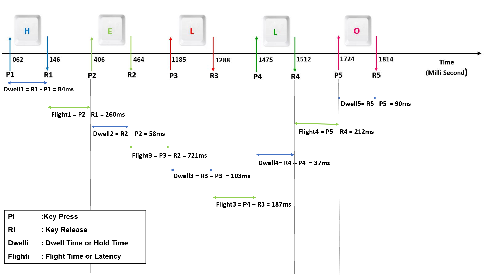

# Correlation Between Keystroke Dynamics On Mobile Devices With Time
In this research we set out to find the answer to the question of how features associated with  keystroke dynamics when using a mobile device, such as typing speed varies in accordance with the time of day for a typical user. We do this by collecting keystroke dynamics metadata using an Android keyboard application called Language Logger, from a set of 15 users over a period 80 days with metadata for 344,995 actual keystrokes.  This includes date and time of typing on the smartphone, along with timing information covering dwell time while a key is pressed, and flight time as the time taken to move to the next key, in a stream of continuous keyboard data entry.
Our results find that there are large variance across users and some are affected by time of day while others are not.However, there are other factors which impact alertness and hence typing speed which we cannot account for such as mood or energy level, and this would be future work.
# I. Introduction
As we know, mobile phones are an indispensable part of everyday life. According to a study conducted by Statista in 2020, the number of mobile users worldwide stood at 6.95 billion, with forecasts suggesting, this is likely to rise to 7.1 billion by 2021[22].The popularity of mobile phones and their easy accessibility to the internet results in people increasingly communicating via typed communication rather than oral communication. 

Interestingly, with such an increase in the use of typing information onto smartphone devices, we believe there could  exist a  relationship between typing speed on the device, and time of the day.  This could be based on the fact that people are more or less alert and attentive to their typing depending on whether they are more or less tired and this fatigue, which varies throughout the day, may be demonstrated in different typing speeds at different times of day. 

In this work we record keystroke dynamics on mobile devices during daily usage and analyse how it correlates with different times of a day. Keystroke dynamics, keystroke bio-metrics, typing dynamics and lately typing bio-metrics, refer to the detailed timing information which describes exactly when each key was pressed and when it was released as a person is typing on a mobile keyboard[19].

The rest of this paper is organised as follows. In the next section we provide a review of related work, and then the system description of the keystroke logging application we used along with the  logging information. That is followed by a description of raw data collection, the  data analysis steps, and the conclusions drawn from that analysis  and finally some indications of future work. 

# II. RELATED WORK
The original application for keystroke dynamics with accurate timing information was as a form of user authentication and work in this area goes back over 4 decades, from 1980 onwards and with regular re-visits to the topic e.g. [6] [11] [14]. One of the most important advantages of keystroke dynamics is low implementation and deployment cost [27]. Keystroke dynamics based authentication uses keystroke patterns provided by the user who wants to be authenticated. Bio-metric data for keystroke dynamics are extracted by finding numerous timing characteristics related to keystrokes [6] [3] [16] [12]. These timing characteristics are then transformed to some feature descriptors in order to represent human behaviour with the keyboard. Principally, the following two timing features are used in keystroke dynamics: (a) dwell time is the time lag between press and release of a key and (b) flight time is the time lag between press and release of two successive keys [6][3][21].

Figure 1 shows timing information logged when a user types the the word ‘HELLO’ on a smartphone. A Di-graph is the timing information between two consecutive keystrokes [9][24] and can be grouped into two classes, including dwell time (DT) or Hold Time and Flight Time (FT) or Latency. Dwell time corresponds to the hold time, which is the time interval between key press and key release and flight time is the time interval between releasing one key and pressing the next key, or in other words the time taken for the user’s finger to ‘fly’ from one key to the next [4]. In Figure 1 we see that when the user pressed the “H” key it was a time 0.062 seconds into the recording (point P1) and then the user released the “H” key at time 0.146 seconds into the recording at point R1, so the dwell time for that key was 0.084 seconds, or 84ms. The user’s finger, and it could be any finger not necessarily the one used to press the H, then pressed the “E” key at time 0.406 seconds or point P2 in the recording and held it pressed for 58ms. The flight time between the “H” and the “E”, the gap between R1 and P2, was 260ms. This example shows the timing characteristics of the keystroke dynamics on a smartphone.

 
<em><b>Figure 1. Di-graph timing information logged when a user types the word ’HELLO’ on a mobile device</b></em>

Keystroke logging is also used in measuring writing fluency and flow and analysis of the timing information can reveal traces of the underlying cognitive processes behind writing or typing [18]. The premise here is that we establish a baseline for our keystroke timing information gathered over a long period and at any given period during the day we can compare the current dynamics with the baseline to see if we are typing faster, or slower, perhaps indicating that we are in full creative flow or that we are pondering our thoughts as we write. This also exploits pause location as we type and whether pauses occur between words, between sentences or even between paragraphs and what insights into the author’s thinking can be gleaned from such pauses [17]

He Huang et al. [13] uses local and periodic typing dynamics for personalised mood prediction. According to their findings, the fastest typing speed occurs at 6:00 and remains
stable between 8:00 to 20:00, and then it becomes significantly slower during the night. They suspect that this is primarily due to fatigue caused by the circadian rhythm which is a biological process that displays an endogenous oscillation of 24 hours [10] [26]. This cycle runs in the background of the human brain and cycles between sleepiness and alertness at regular intervals. It is commonly known that individual depressive moods vary according to the circadian rhythm, as well as with the day of the week [26]. In our work in this paper it will be interesting to see if we observe similar changes to keystroke timing depending on the time of day at which they keystrokes are typed.

There are other applications for keystroke dynamics including cryptography applications [8], adaptive and personalised keyboards [29] and even as digital biomarkers. For example, the ‘BiAffect’ mobile app can be used for identifying persons with bipolar disorder and unobtrusively predicting depression severity [23] and the ‘Neurokeys’ mobile app can give earlywarning signals for disease activity in patients diagnosed with Multiple Sclerosis (MS) [28]. In some recent work, Lam et al.’s studies among 102 subjects with MS and 24 control subjects found that keystroke dynamics are a promising and valid surrogate marker for determination of clinical disability in MS [15]. For this study the participants used a smartphone rather than computer keyboard showing that keystroke dynamics from mobile devices can be just as useful for such applications as dynamics taken from computer keyboards.

This work is a follow-up of previous work by Smeaton, Krishnamurthy and Suryanarayana [25], which records the keystroke dynamics from a person’s laptop during daily usage and analyses the typing speed of a range of bigrams (adjacently-typed alphabetic characters). That work then tried to correlate bigram typing speed with sleep score using data
collected from 4 participants over more than 6 months data logging. In that research, they found that bigram timing information can vary during the same day and across the day
depending, they believe, on the participant’s stress, fatigue and emotions. Also, they noted that there is no correlation between daily typing speed of any of the commonly used
bigrams and sleep score. This result was observed in all participants. In addition, they concluded that a measure of user fatigue based on a simple sleep score from the previous night’s sleep is insufficient to measure participants’ fatigue levels. They concluded that the timing data retrieved from keystroke dynamics could be used as part of a lifelog, especially to gain insights into the more complex cognitive processes in our daily life and it would be interesting to explore keystroke dynamics on mobile devices and see how the timing information from mobile devices might correlate with stress, cognitive load from multi-tasking, fatigue and distraction. In this paper we set out to search for a correlation with time of day.

As we know smartphones play crucial role in our lives and are essential part of every individual today. Smartphones can be thought as an appropriate tool to gather information regarding a person because they are so ubiquitous. Here in this research, we utilise keystroke dynamics from smartphone keyboards as a way to draw inferences in the areas of
behavioural science and other physiologies. Previous studies conducted were primarily focused on personal computer keyboard strokes but in this work, the study is based on keystrokes in smartphones.

Keystroke dynamics on mobile devices is relatively new as compared to keystroke dynamics on desktops and laptops. The first known study of this type was by Clarke et al in 2002 [20] but since then there has been little research work published. In our work we used the ‘LanguageLogger’ [5] [7] Android keyboard application for smartphones to log keystrokes with their timestamps and transfer this timing metadata to a server. This data is then analysed to uncover any underlying correlations between keystrokes and other parameters such as time of day.

It is important to note that we are not concerned with the actual keys that a user presses on their smartphone, and in fact much of the work in this area including ours, does not record the actual keys pressed, just the timing information. This makes issues of user privacy and data protection, much less challenging to manage.

